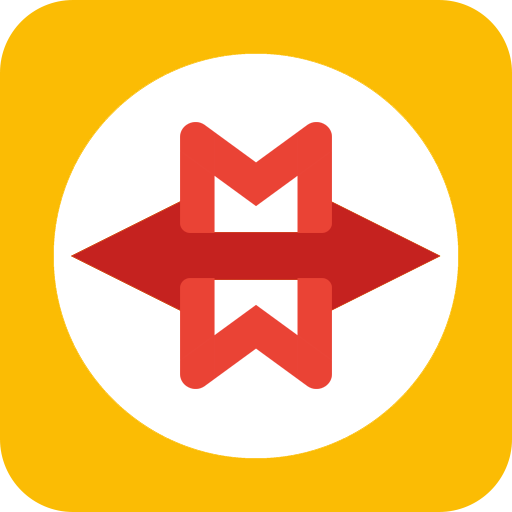
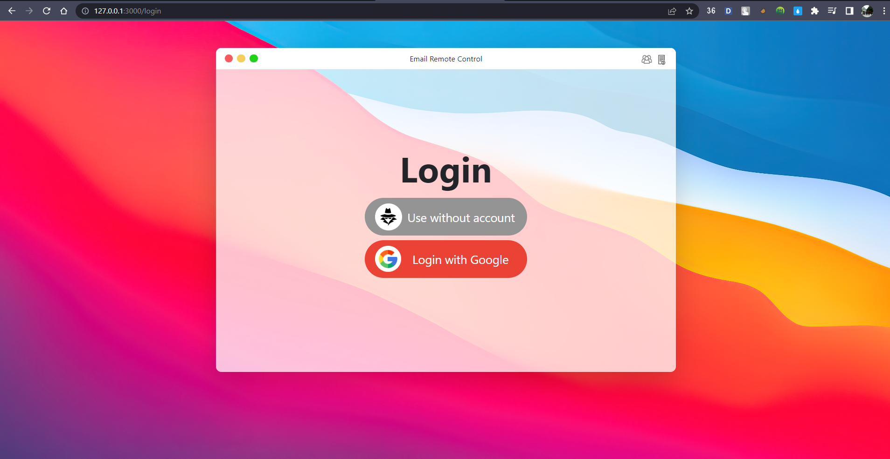
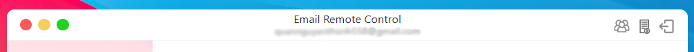

<h1 align="center">
  </img>
  <br>
  <b>Remote PC control by email</b>
</h1>

<p align="center">Program to control remote computer by email.</p>

<div align="center">
  <b>
      <a href="https://youtu.be/bdlXKWeg4tY">Demo</a>
    <span> · </span>
      <a href="#about-the-project">About the project</a>
        <span> · </span>
      <a href="#getting-start">Getting start</a> 
        <span> · </span>
      <a href="#description">Description</a>
      <span> · </span>
      <a href="#member">Member</a>
      <span> · </span>
      <a href="#references">References</a>
  </b>
</div>

## Table of contents

-  [Table of contents](#table-of-contents)
-  [About the project](#about-the-project)
   -  [Introduction](#introduction)
   -  [Demo](#demo)
   -  [Screenshots](#screenshots)
      -  [Login](#login)
      -  [Control](#control)
      -  [Review](#review)
      -  [Detail information](#detail-information)
      -  [Ribbon bar](#ribbon-bar)
   -  [Technology](#technology)
   -  [Features](#features)
-  [Getting start](#getting-start)
   -  [Prerequisites](#prerequisites)
   -  [Run locally](#run-locally)
-  [Member](#member)
-  [References](#references)

## About the project

### Introduction

Program to control remote computer by email, in which:

-  **The user** (client) sends an email (containing requests to be made by the server) to the server's email (server).
-  **The server** reads the incoming email, performs the tasks the client sends and sends the results back to the client by replying to the client's email.

### Demo

Check out the [**demo video**](https://youtu.be/bdlXKWeg4tY) to see the application in action.

### Screenshots

#### Login

<figure>
  
  <figcaption>Login page</figcaption>
</figure>
User have 2 choice to using the program:

-  **Without google account**, in this option, user can use program in anonymous mode (In this feature, the user has to send and view the response manually, the program only helps the user to write valid commands to the server)
-  **Within google account**, in this option, user must provide read and send email permission (In this feature, the program will help you to send and view reply email)

#### Control

<figure>
  
  <figcaption>Control page</figcaption>
</figure>
Allow user selects the command to be executed by the server, the program will auto generate email and send to server.

#### Review

<figure>
  
  <figcaption>Review page</figcaption>
</figure>
The application will wait for the server to reply then display the result in the window. User can:
See the content of the reply mail
See the details of the attached file
Download the attached file to the Download folder

#### Detail information

<figure>
  
  <figcaption>About us</figcaption>
</figure>
Show information about the project and the members.

<figure>
  
  <figcaption>User manual</figcaption>
</figure>
Show user manual.

#### Ribbon bar

<figure>
  
  <figcaption>Ribbon bar</figcaption>
</figure>
The application will wait for the server to reply then display the result in the window. User can:

-  See the content of the reply mail
-  See the details of the attached file
-  Download the attached file to the
-  Download folder

### Technology

-  **Framework:** Flask
-  **Backend:** Python
-  **Frontend:** HTML, CSS, JavaScript, Bootstrap 5

### Features

**Client application:** A web GUI app to control remote computer, in which:

-  Login with google account.
-  Send email to server.
-  Get and show reply email from server.
-  View detail and download attached files.

**Server application:**

-  Key logger: Get keystrokes from keyboard.
-  Shutdown/logout:
   -  Shutdown computer.
   -  Logout computer.
-  MAC address: Get computer's MAC address.
-  Save screenshot.
-  Capture webcam image.
-  Directory tree:
   -  List all files in a directory.
   -  Copy files to client computer.
   -  Copy files to server computer.
   -  Delete files.
-  App process:
   -  List processes.
   -  List applications.
   -  Kill processes.
   -  Start applications.
-  Registry:
   -  Get registry value.
   -  Set registry value.
   -  Create registry key.
   -  Delete registry key.

## Getting start

### Prerequisites

-  Python `>= 3.10.7`
-  Enable IMAP in your server email, see [Turn POP & IMAP on or off for users](https://support.google.com/a/answer/105694?hl=en)
-  Client environment variables:

   -  **Environment:** add file `.env` in `/Client`, `.env` config:

      -  `SECRET_KEY`: a key used by Flask to encrypt and sign session data.
      -  `PORT`: specify which port the Flask application should listen on.
      -  `SERVER_EMAIL_ADDRESS`: the email address of the server, which is received email from client
      -  `SERVER_EMAIL_PASSWORD`: the password of the server's email

      Example:

      ```bash
      # .env
      SECRET_KEY = "RemoteControlByEmail-HCMUS"
      PORT = 3000
      SERVER_EMAIL_ADDRESS = "server@example.com"
      SERVER_EMAIL_PASSWORD = "server_password"
      ```

      > **Note:** If you want to use this example environment, you need to rename it to .env.

   -  **Credentials:** get Gmail API credentials file by [Gmail API instruction](https://developers.google.com/gmail/api/quickstart/python#authorize_credentials_for_a_desktop_application) then add file `credentials.json` in `/Client`

      Example:

      ```json
      // credentials.json
      {
      	"installed": {
      		"client_id": "client_id.apps.googleusercontent.com",
      		"project_id": "gmail-remote-control",
      		"auth_uri": "https://accounts.google.com/o/oauth2/auth",
      		"token_uri": "https://oauth2.googleapis.com/token",
      		"auth_provider_x509_cert_url": "https://www.googleapis.com/oauth2/v1/certs",
      		"client_secret": "client_secret",
      		"redirect_uris": ["http://localhost"]
      	}
      }
      ```

      > **Note:** If you want to use this example environment, you need to rename it to credentials.json.

> **Note**: The `credentials.json` file is only used for the first time the user logs in, after that the program will automatically generate a `token.json` file to store the user's credentials.

### Run locally

Clone the project:

```bash
git clone https://github.com/HCMUS-Project/Gmail-Remote-Control.git
```

Go to the project directory:

```bash
cd Gmail-Remote-Control
```

Install dependencies:

```bash
pip install -r requirements.txt
```

Start the server:

```bash
python Server/server.py
```

The server will run on port 5656 and with host 0.0.0.0

Start the client:

```bash
python Client/client
```

The client will run on PORT which define in `.env` file and with host:

-  Running on http://127.0.0.1:[PORT]

## Member

-  19127392 - [To Gia Hao](https://github.com/To-Gia-Hao)
-  **19127525 - [Nguyen Thanh Quan](https://github.com/QuanBlue)**
-  19127625 - [Lam Chi Van](https://github.com/chivanz128)

## References

[Python 3.11 Document](https://docs.python.org/3/)
[Flask document](https://flask.palletsprojects.com/en/2.2.x/)  
[Youtube - MacOS big sur theme](https://www.youtube.com/watch?v=NVT5oQ_6_hU&ab_channel=MartinBozhurski)  
[Gmail API Document](https://developers.google.com/gmail/api/guides)  
[PIL Documentation](https://pillow.readthedocs.io/en/stable/)  
[Pynput Documentation](https://pynput.readthedocs.io/en/latest/)  
[Psutil Documentation](https://psutil.readthedocs.io/en/latest/)
